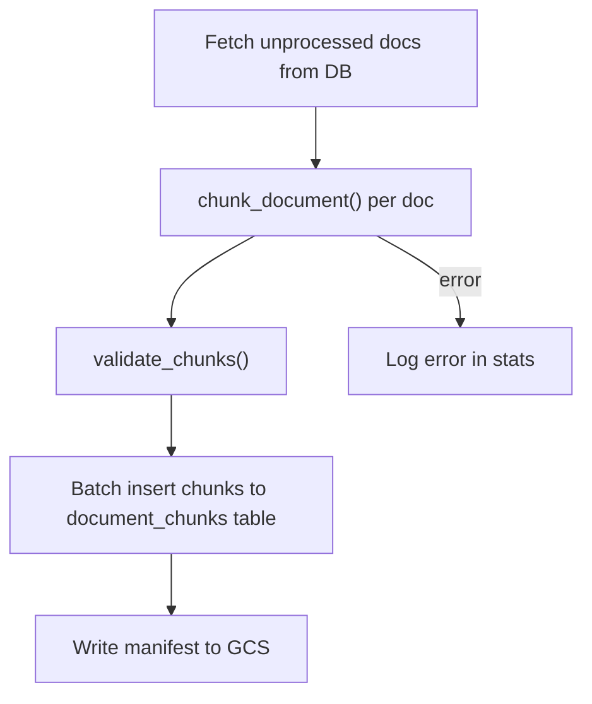
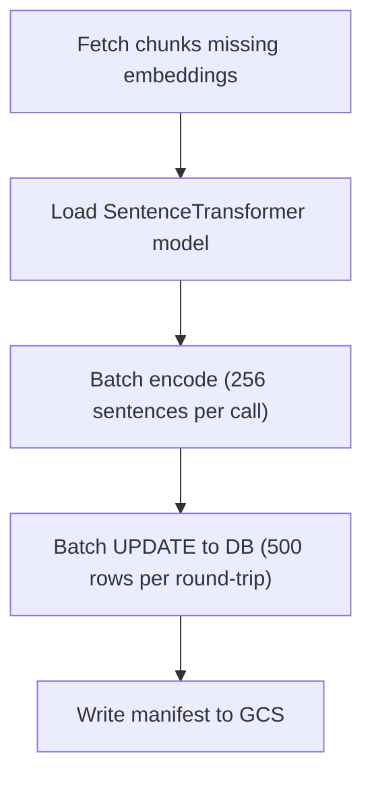
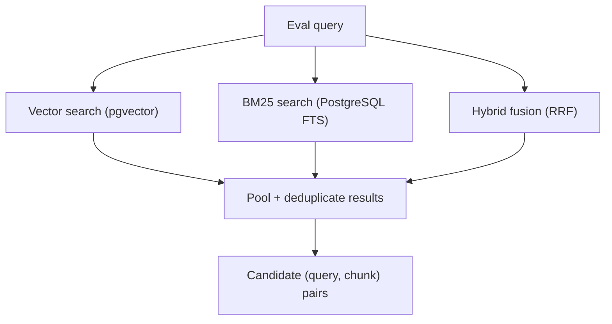
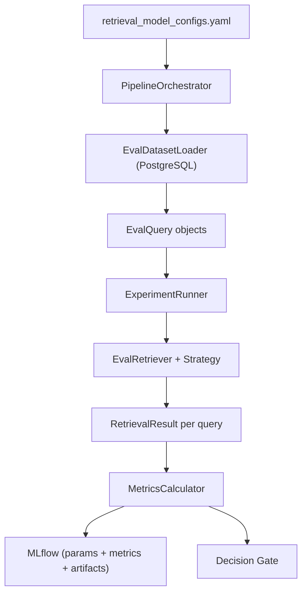
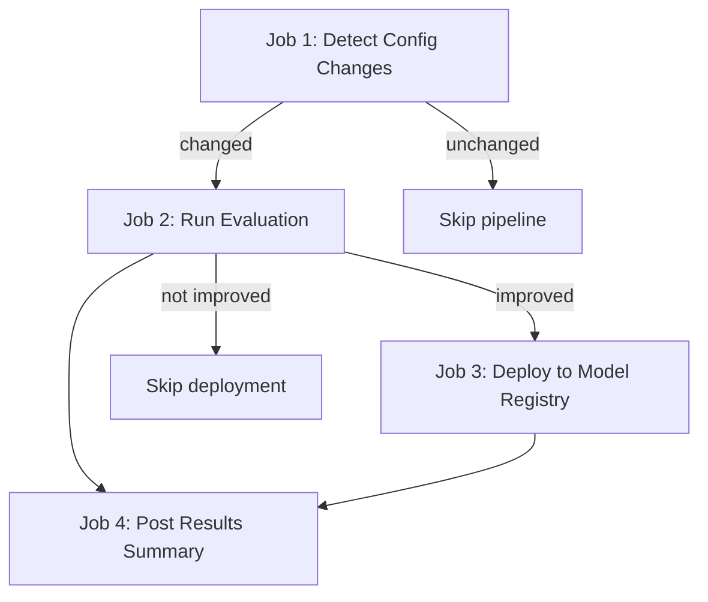

# Model Development Documentation

## 1. Airflow DAGs

### DAG: `chunking_embedding_pipeline`

| Property | Value |
|---|---|
| **DAG ID** | `chunking_embedding_pipeline` |
| **Schedule** | `None` (manually triggered) |
| **Catchup** | `False` |
| **Start Date** | 2024-01-01 |
| **Tags** | `chunking`, `embeddings`, `processing` |

### Task Dependency Graph


### Task Details

| Task ID | Operator | What It Does |
|---|---|---|
| `start` | `BashOperator` | Logs pipeline start timestamp |
| `run_chunking` | `PythonOperator` | Runs the chunking pipeline (fetch docs → chunk → insert → write manifest) |
| `run_embeddings` | `PythonOperator` | Runs the embedding pipeline (fetch missing → encode → update DB → write manifest) |
| `complete` | `BashOperator` | Logs pipeline completion timestamp |

### Key Design Decisions

- **Demo mode** — Both tasks support a `DEMO_MODE` Airflow variable. When enabled, the pipelines limit processing to 10 documents for quick validation.
- **Sequential execution** — Chunking must complete before embedding generation, since embeddings operate on the chunks produced by the chunking step.

---

## 2. Document Chunking

### How It Works (`src/chunking/`)

Documents are split into fixed-size, overlapping chunks with contextual headers. The chunking pipeline reads processed documents from PostgreSQL, applies a splitting strategy, and writes the resulting chunks back to the database.

### Splitting Strategies

The chunker picks a strategy based on document length and structure:

| Strategy | When It's Used | How It Works |
|---|---|---|
| **Single Chunk** | Document is under `min_doc_words` (150) | Returns the full text as one chunk |
| **Structural** | Document contains round boundary markers | Splits at interview round headers (e.g., "Round 1:", "HR Interview:") |
| **Fixed Window** | Default for longer documents | Sentence-aligned sliding window with configurable overlap |

Strategy detection happens in `detect_strategy()`. Round boundary patterns are defined in `chunking_config.yaml` — they cover numbered rounds, named stages (phone screen, onsite, system design), and abbreviated formats (F2F, OA).

### Chunk Structure

Each chunk is a frozen `DocumentChunk` dataclass:

| Field | Description |
|---|---|
| `chunk_id` | UUID v4 |
| `document_id` | Links back to the source document |
| `chunk_index` | 0-based position in the document |
| `total_chunks` | Total chunks produced from this document |
| `chunk_text` | Header + raw text |
| `raw_text` | Text without the header |
| `word_count` | Word count of `raw_text` |
| `char_start_offset` | Character offset in the original document |
| `char_end_offset` | Character offset end |
| `strategy` | Which splitting strategy was used |
| `round_label` | Interview round name (structural splits only) |

### Contextual Headers

Every chunk gets a header built by `build_header()`:

```
Company: Google | Topics: DSA, System Design | Part: 2 of 5
```

This header provides retrieval context — when a chunk is retrieved by the search system, the header tells the user what company and topics the interview covered, and where this chunk fits in the full experience.

### Validation

`validate_chunks()` runs post-chunking integrity checks:

- Every chunk must have a non-empty `document_id`
- Oversized chunks (exceeding `CHUNK_SIZE_WORDS + OVERLAP_WORDS` by more than a tolerance) generate warnings
- Chunks with a `company` attribute are checked for header consistency
- An assertion is raised if any errors are found; warnings are logged but don't block the pipeline

### Pipeline Flow (`src/chunking/pipeline.py`)



1. **Fetch** — Queries `processed_documents` for rows not yet chunked
2. **Chunk** — Calls `chunk_document()` per document, collecting results and errors
3. **Insert** — Uses `psycopg2.extras.execute_values()` for batch insertion into `document_chunks`
4. **Manifest** — Writes a JSON manifest to GCS with chunk counts, timing, and error stats

### Configuration (`chunking_config.yaml`)

| Parameter | Default | Description |
|---|---|---|
| `chunk_size_words` | 500 | Target words per chunk |
| `overlap_words` | 50 | Word overlap between consecutive chunks |
| `min_doc_words` | 150 | Below this, the doc becomes a single chunk |
| `round_boundary_patterns` | 17 patterns | Regex patterns for detecting interview round headers |

---

## 3. Embedding Generation

### How It Works (`src/embeddings/`)

The embedding pipeline generates dense vector representations for each chunk using SentenceTransformer bi-encoder models. These embeddings are stored alongside the chunks in PostgreSQL (via pgvector) and used for vector similarity search at retrieval time.

### Pipeline Flow (`src/embeddings/pipeline.py`)



1. **Fetch** — Queries `document_chunks` for rows where the embedding column is `NULL`
2. **Load** — Loads the bi-encoder model (lazy, once per model)
3. **Encode** — Encodes texts in batches of 256 with `normalize_embeddings=True`
4. **Update** — Writes embeddings back to the database using `execute_values()` in batches of 500
5. **Manifest** — Writes a JSON manifest to GCS with counts and timing

### Multi-Model Support

The pipeline processes multiple embedding models in a single run. Each model gets its own column in `document_chunks`:

| Model | Column Name |
|---|---|
| `all-MiniLM-L6-v2` | `embeddings_all_minilm_l6_v2` |
| `all-mpnet-base-v2` | `embeddings_all_mpnet_base_v2` |

Column names are derived from the model name: take the last segment after `/`, replace hyphens with underscores, prefix with `embeddings_`. This convention is shared between the embedding pipeline and the evaluation pipeline.

### Configuration (`embeddings_configs.yaml`)

| Parameter | Default | Description |
|---|---|---|
| `biencoder_models` | `[all-MiniLM-L6-v2, all-mpnet-base-v2]` | Models to generate embeddings for |
| `encode_batch` | 256 | Sentences per `model.encode()` call |
| `db_batch` | 500 | Rows per database UPDATE round-trip |

---

## 4. Eval Dataset Construction

### Overview (`src/eval_dataset_labelling/`)

Before evaluating retrieval models, we need ground-truth relevance labels. This module constructs the eval dataset using a three-step process: retrieve candidate chunks, judge their relevance with an LLM, and load the labeled data into PostgreSQL.

### Step 1: Candidate Retrieval (`dataset_generator.py`)

For each eval query, the generator retrieves candidate chunks using three strategies and pools the results:



- **Vector search** — Encodes the query with SentenceTransformer, retrieves nearest chunks by cosine similarity
- **BM25 search** — Uses PostgreSQL `ts_rank_cd` over pre-built `tsvector` columns
- **Hybrid fusion** — Runs both, normalizes scores to [0, 1], and combines with configurable weights using Reciprocal Rank Fusion

Results from all three strategies are pooled and deduplicated into a flat list of (query, chunk) pairs.

### Step 2: LLM Relevance Judging (`llm_relevance_judge.py`)

Each (query, chunk) pair is sent to an OpenAI model for graded relevance scoring:

| Grade | Meaning |
|---|---|
| 0 | Not relevant |
| 1 | Partially relevant |
| 2 | Highly relevant |

The judge (`judge_pair`) sends a structured prompt to the LLM, parses the response to extract a numeric grade (0–2), and handles retries on API failures. Chunk text is truncated to a configurable token limit to stay within context windows. Results are processed concurrently using `ThreadPoolExecutor`.

### Step 3: Loading Labels (`labeled_data_to_db.py`)

The labeled CSV (query, chunk_id, doc_id, category, relevance grade) is read from GCS and batch-inserted into the `eval_dataset` table in PostgreSQL. This table is what `EvalDatasetLoader` queries during model evaluation.

---

## 5. Retrieval Model Evaluation

### Overview (`src/evaluation/evaluator.py`)

The evaluation pipeline measures how well different retrieval configurations serve the eval dataset. It runs each model config against every eval query, computes standard retrieval metrics, performs bias analysis, and logs everything to MLflow.

### Architecture



### Retrieval Strategies

Three strategies are available, selected per config via `retrieval_mode`:

| Strategy | Class | Retrieval Method |
|---|---|---|
| **Vector** | `VectorStrategy` | Encodes query with SentenceTransformer, retrieves by cosine similarity via pgvector (`<=>` operator) |
| **BM25** | `BM25Strategy` | PostgreSQL full-text search using `ts_rank_cd` over `tsvector` columns |
| **Hybrid** | `HybridStrategy` | Runs Vector and BM25 independently, merges via Reciprocal Rank Fusion |

`build_strategy()` dispatches to the correct class based on `config.retrieval_mode`.

#### Hybrid RRF Fusion

The hybrid strategy merges two ranked lists using Reciprocal Rank Fusion:

```
score(chunk) = vector_weight × 1/(rrf_k + vector_rank) + bm25_weight × 1/(rrf_k + bm25_rank)
```

Where `rrf_k` (default 60), `vector_weight`, and `bm25_weight` are configurable. Chunks appearing in both lists get contributions from both terms, boosting them higher.

### Metrics

`MetricsCalculator` computes at k = 5, 10, and 15:

| Metric | Formula | What It Measures |
|---|---|---|
| **MRR@k** | 1/rank of first relevant result | How quickly a relevant chunk appears |
| **Recall@k** | \|relevant ∩ retrieved\| / \|relevant\| | Coverage of all relevant chunks |
| **Precision@k** | \|relevant in top-k\| / k | Proportion of retrieved chunks that are relevant |
| **NDCG@k** | DCG / IDCG (with graded relevance) | Ranking quality accounting for relevance grades |

Additional metrics:
- **Score separation** — Mean retrieval score of grade-2 chunks minus mean of grade-0 chunks. Higher is better.
- **Storage footprint** — Estimated embedding storage in MB, computed from row count and embedding dimension.

### Model Selection Score

Configs are ranked by a composite score:

```
selection_score = 0.47 × NDCG@10 + 0.29 × Recall@10 + 0.18 × MRR@5 + 0.06 × storage_efficiency
```

Where `storage_efficiency = min(1.0, 120 / storage_mb)`. The weights prioritize ranking quality and recall while adding a small penalty for storage-heavy configurations.

### Bias Detection

#### Slicing by Query Category

The eval dataset tags each query with a category (e.g., behavioral, technical, system design). `per_category_metrics` splits results by category and computes the full metric set for each slice independently.

#### Disparity Scores

`compute_bias_report` measures fairness as:

```
disparity = max(metric across categories) − min(metric across categories)
```

For example, if NDCG@10 is 0.85 for behavioral queries but 0.42 for system design queries, the disparity is 0.43. A high disparity means the model performs inconsistently across question types.

#### Underperforming Slices

Categories whose metric falls more than 10 percentage points below the overall mean are flagged. The report includes mitigation suggestions:
- Upsample queries from underperforming categories in the eval set
- Apply query-time diversity constraints to balance retrieval

#### Why This Matters

For an interview preparation tool, category bias has direct user impact. If the system retrieves well for behavioral questions but poorly for system design questions, users preparing for system design interviews get lower-quality results.

### Decision Gate

`_apply_decision_gate` checks whether an open-source model is within 5% of the best NDCG@10 score:
- **Within 5%** — Recommends the open-source config (lower cost, no API dependency)
- **Beyond 5%** — Logs that the proprietary model may be justified

This gate runs after all configs are evaluated and is logged for team review.

---

## 6. Experiment Tracking

### MLflow Run Structure

All evaluation runs are tracked in MLflow with nested parent/child runs:

```
Parent Run: pipeline_cicd_<timestamp>
├── Child Run: <model_config_1>    (params + metrics + artifacts)
├── Child Run: <model_config_2>    (params + metrics + artifacts)
└── Child Run: comparison_summary  (model_comparison.json + bias_comparison.json)
```

### What Gets Logged

**Per child run (per model config):**

| Type | Content |
|---|---|
| **Parameters** | model_name, embedding_dim, chunk_size, overlap_size, retrieval_mode, HNSW settings, num_eval_queries |
| **Metrics** | MRR@k, Recall@k, Precision@k, NDCG@k (at k=5,10,15), selection_score, storage_mb, bias disparity scores |
| **Artifacts** | `per_query_results.json`, `category_breakdown.json`, `bias_report.json`, `score_distribution_by_grade.json` |
| **Tags** | `run_type=model_eval`, `model_family`, `retrieval_mode`, `eval_version=v1` |

**Comparison summary run:**

| Type | Content |
|---|---|
| **Parameters** | `best_config`, `least_biased_config` |
| **Metrics** | `best_selection_score`, `best_ndcg_at_10` |
| **Artifacts** | `model_comparison.json` (ranked by selection_score), `bias_comparison.json` (ranked by least bias) |

**Parent run:**

| Type | Content |
|---|---|
| **Parameters** | `best_config` |
| **Metrics** | `best_selection_score`, `best_ndcg_at_10`, `best_recall_at_10`, `best_mrr_at_5` |
| **Tags** | `run_type=pipeline_parent`, `run_label`, `deployment_status` (set to `deployed` after successful CI/CD deployment) |

---

## 7. CI/CD Pipeline

### Testing Pipeline (`.github/workflows/ci.yml`)

Triggers on push and pull request to `main`.

| Step | What It Does |
|---|---|
| Install dependencies | Python 3.10, Airflow 2.10.4, all requirements |
| Run tests | `pytest` with coverage reporting (XML + HTML + terminal) |
| Coverage threshold | Enforces 80% coverage (`coverage report --fail-under=80`) |
| Upload artifacts | Test report, coverage report uploaded as build artifacts |

### Retrieval Eval & Deploy Pipeline (`.github/workflows/eval_pipeline.yml`)

Triggers when `src/evaluation/retrieval_model_configs.yaml` is modified on `dev`.



#### Job 1: Detect Changes

Diffs `retrieval_model_configs.yaml` against the previous commit. If no changes, the entire pipeline is skipped.

#### Job 2: Evaluate

1. Authenticates to GCP and connects to Cloud SQL
2. Runs `PipelineOrchestrator` with all configs from the YAML file
3. Identifies the best config by `selection_score`
4. Queries MLflow for the previously deployed model (tagged `deployment_status=deployed`)
5. Compares scores — proceeds to deployment only if improvement ≥ `MIN_IMPROVEMENT_THRESHOLD` (0.01)

#### Job 3: Deploy

1. **GCS upload** — Config YAML, eval results JSON, and a deployment manifest (with git SHA, timestamp, pipeline run ID) are uploaded to `gs://interviewprep-ai-mlflow-artifacts/model-registry/retrieval-models/<timestamp>/`
2. **Vertex AI registration** — Registers the model in Vertex AI Model Registry with:
   - Version aliases: `latest`, `production`
   - Description with selection score, NDCG@10, Recall@10
   - Labels with config name, score, pipeline ID, git SHA
   - If the model already exists, a new version is added; otherwise, a new model resource is created
3. **MLflow tagging** — The parent run is tagged with `deployment_status=deployed`, `deployment_timestamp`, `deployment_target=vertex-ai-model-registry`, and the deployed config name

#### Job 4: Notify

Posts a summary to the pull request as a comment:
- Best config name and selection score
- Previous best score
- Deployment status (deployed / not deployed / failed)
- Config diff (collapsed in a `<details>` block)

---

## 8. Configuration

### Retrieval Model Configs (`src/evaluation/retrieval_model_configs.yaml`)

This file drives both the evaluation pipeline and the CI/CD workflow. Modifying it triggers the eval pipeline.

```yaml
mlflow:
  tracking_uri: "http://<host>:5000"

evaluation:
  relevance_threshold: 1   # Minimum relevance grade to count as "relevant"
  max_k: 15                # Maximum k for metric computation

configs:
  - model_name: "bm25-baseline"
    embedding_dim: 0
    chunk_size: 512
    overlap_size: 64
    retrieval_mode: "bm25"
    bm25_config:
      search_column: "chunk_text"
      tsvector_column: "chunk_tsvector"
      search_language: "english"

  - model_name: "sentence-transformers/all-MiniLM-L6-v2"
    embedding_dim: 384
    chunk_size: 512
    overlap_size: 64
    retrieval_mode: "hybrid"
    hybrid_config:
      rrf_k: 60
      vector_weight: 0.5
      bm25_weight: 0.5
```

Adding a new model config to this file and pushing to `dev` will automatically trigger evaluation, comparison, and (if improved) deployment.

---

## 9. Notifications

### Airflow Email

The scraping pipeline DAG uses Airflow's `EmailOperator` to send pipeline status reports after each run. The `build_email` task constructs an HTML body with scraper counts, preprocessing stats, DB load results, and failed task details. `send_notification_email` delivers it to the team using `trigger_rule='all_done'`, ensuring notification regardless of pipeline outcome.

Recipients are configured in `dags/scraping_pipeline.py`:

```python
NOTIFY_EMAILS = [
    'kansara.dh@northeastern.edu',
    'lnu.prat@northeastern.edu',
    'patel.shivangm@northeastern.edu',
    'kanani.h@northeastern.edu',
    'shah.shreyc@northeastern.edu',
    'parikh.malh@northeastern.edu',
]
```

### GitHub PR Comments

The retrieval eval CI/CD pipeline posts evaluation results as a PR comment via `actions/github-script`. The comment includes the best config, selection score, previous baseline, deployment status, and a collapsible config diff.

---

## 10. Testing

### Test Coverage

| Module | Test File | Tests | Coverage |
|---|---|---|---|
| Chunking (chunker) | `test/chunking/test_chunker.py` | 30 | Word count, sentence splitting, header building, strategy detection, chunk_document, validate_chunks |
| Chunking (pipeline) | `test/chunking/test_pipeline.py` | 9 | DB fetch, chunk insertion, GCS manifest, pipeline run |
| Embeddings | `test/embeddings/test_pipeline.py` | 9 | Column naming, missing embeddings fetch, batch update, manifest, run |
| Eval Dataset (generator) | `test/eval_dataset_labelling/test_dataset_generator.py` | 16 | Score normalization, hybrid fusion, BM25 index, result pooling, dataclasses |
| Eval Dataset (judge) | `test/eval_dataset_labelling/test_llm_relevance_judge.py` | 9 | Truncation, response parsing, client init, judge_pair with retries |
| Eval Dataset (loader) | `test/eval_dataset_labelling/test_labeled_data_to_db.py` | 6 | CSV reading from GCS, batch DB insertion |
| Evaluation | `test/evaluation/test_evaluator.py` | 35 | Metrics (MRR, Recall, Precision, NDCG), strategies, RRF fusion, bias report, config loading, decision gate |
| DAG Tasks | `test/test_dag_tasks.py` | 10 | Helper functions (_as_bool, _as_int, _safe_variable_get), task callables |

### Mocking Strategy

All external dependencies are mocked to keep tests fast, deterministic, and credential-free:

- **PostgreSQL** — `MagicMock` cursor with pre-defined `fetchall` return values
- **GCS** — `MagicMock` storage client and blob objects
- **SentenceTransformer** — `MagicMock` model returning fixed-dimension arrays
- **OpenAI** — `MagicMock` client returning structured judge responses
- **MLflow** — `MagicMock` for start_run, log_metrics, log_params, log_artifact
- **Airflow** — `MagicMock` for Variable.get; `pytest.importorskip` to skip if Airflow is not installed

### CI Integration

The test suite runs on every push/PR to `main` via `.github/workflows/ci.yml`. Coverage is enforced at 80%.
